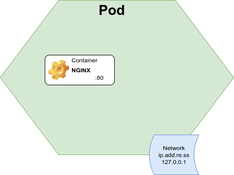

# $ kubectl explain pod

[$ kubectl explain](../)

[](http://www.youtube.com/watch?v=E52yBVYcNz4 "$kubectl explain pod")

A pod is the base level of compute provided by Kubernetes. Think of it as the smallest deployable unit of computing.

A Pod is not an application, it's not a container, it is actually a collection of compute resources that are assigned to be used by one or more containers in which your application runs.

The contents of a pod are always colocated (on the same host) and are scheduled and run as a shared context.  Effectively a Pod is a logical host that contains one or more tightly coupled containers that make up your application.

So what exactly then is a pod?  It's a set of linux namespaces, cgroups, (and potentially other facets of isolation) used to Isolate "docker" containers. Of course in modern clusters it may not be specifically a docker container, it might be containerd, or even a microvm, but the concept of a pod remains the same.

If you're familiar with docker think of a pod as a collection of containers with shared namespaces and shared filesystem volumes.  If you're familiar with VMs think of a pod as a lightweight VM with just enough OS to run one or more applications. (although the analogy with a VM falls apart fairly quickly).

While its common for a Pod to contain just a single container, its just as common for a Pod to contain multiple containers that compose together to create your application. This behavior helps run applications that are made up of multiple processes without having to resort to the generally considered to be a bad practice of running multiple processes in the one container.

The containers that share the pod also share resources and dependencies, they share a single network interface (usually an IP address on the pod network, and a localhost) and can share filesystems. The applications running in your containers can thus communicate via networking (localhost) or via the filesystem (files, or unix sockets). Like with processes on a VM care must be taken to avoid network port collisions, etc.

You can ensure that your pod receives enough compute resources by settings resource requests that lets the Kubernetes scheduler know that the Pod needs to be scheduled to a Node with a minimum free amount of CPU and Memory. You can also set resource limits that will set a maximum amount of CPU/Memory that a container in your pod can use.

As well as your application containers a Pod may contain one or more init containers. These init containers are fully executed before your application containers start. This allows you to perform actions such as transform a config file, or collect a file from an object store, to be consumed by your application.

Pods however are designed to be ephemeral or disposable entities. When a Pod is created it is scheduled to a node in your cluster. The Pod remains on that node until you ask for it be removed, or it finishes execution, or if the Pod is evicted due to lack of resources or the Node it is running on fails.

Therefore it is rare that you will actually request a Pod in Kubernetes. You will almost always reach for resource that manages Pods such as a Deployment or a Job. These resources are run by Controllers that wrap the fragility of a Pod with resilience. For instance a Deployment manages one or more copies of a Pod and will replace failed Pods. More on Deployments in the future.

Let's put this into practice...

## Basic NGINX Pod

This is a minimal NGINX Pod that will be scheduled to a node with at least 64mb of memory and a quarter of a CPU Core (250 millicpu) but will be restricted to no more than 128 Megabytes of memory and half a CPU core.

```yaml
apiVersion: v1
kind: Pod
metadata:
  name: website
spec:
  containers:
  - name: nginx
    image: nginx:latest
    resources:
      requests:
        memory: "64Mi"
        cpu: "250m"
      limits:
        memory: "128Mi"
        cpu: "500m"
```


## NGINX Pod with volume and init container

This extends the above Pod and adds an `initContainer` that will clone down the contents of a git repository into a volume that is shared with the `nginx` container.

```yaml
apiVersion: v1
kind: Pod
metadata:
  name: website
spec:
  initContainers:
  - name: git-clone
    image: alpine/git
    command: ["git"]
    args:
      - "clone"
      - "https://github.com/paulczar/kubectl-explain.git"
      - "/var/www/html"
    volumeMounts:
    - mountPath: /usr/share/nginx/html
      name: www
  containers:
  - name: nginx
    image: nginx:latest
    volumeMounts:
    - mountPath: /usr/share/nginx/html
      name: www
  volumes:
  - name: www
    emptyDir: {}
```


## Sources & Further Reading

* [Kubernetes Docs - Pods](https://kubernetes.io/docs/concepts/workloads/pods/)
* [Kubernetes Docs - Managing Resources for Containers](https://kubernetes.io/docs/concepts/configuration/manage-resources-containers/)

[$ kubectl explain](../)