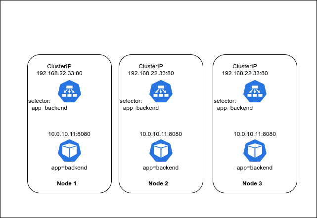
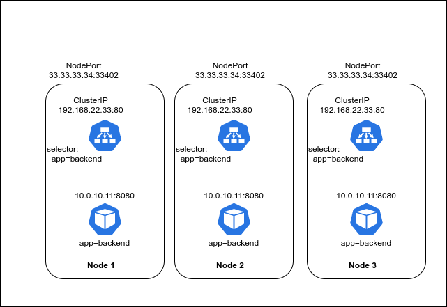
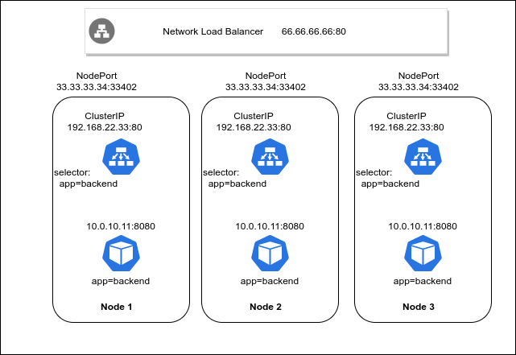

# $ kubectl explain service

[$ kubectl explain](../)

<!---[](http://www.youtube.com/watch?v=/ursPwmJbGW8 "$kubectl explain service") -->

```bash
$ kubectl explain service
DESCRIPTION:
     Service is a named abstraction of software service (for example, mysql)
     consisting of local port (for example 3306) that the proxy listens on, and
     the selector that determines which pods will answer requests sent through
     the proxy.
```

Pods are, As we learned in [$ kubectl explain pod](../pod) ephemeral, they are designed to be disposable. We also learned that each Pod gets an IP address on the Pod network. Since our Pods can come and go, even with a Deployment where we add in resiliency, we do so by duplicating the pod from a template, therefore we are never guaranteed that a given Pod IP address will work in the future.

Almost always you will have a scenario when an application or a Pod requires stable access to another application or Pod, without a stable IP address we do not have a stable endpoint we can use to ensure that access continues to function from one member to the next.

Enter Services.

A Service is an abstraction that creates a consistent endpoint by defining a logical grouping of Pods and a policy on how to access those Pods. A Service utilizes the concept of a [Label Selector](https://kubernetes.io/docs/concepts/overview/working-with-objects/labels/) which is a way for a client to identify a set of resources. This concept of a selector is core to Kubernetes and is in fact the primary grouping mechanism inside of Kubernetes.

Every Kubernetes resource has a `Metadata` field which contains a `Labels` field which is used to provide labels which can then be used by to group resources via a selector. Services uses this to determine which Pods should be accessible through the service.

Effectively a service allows you to decouple the ephemeral endpoints from the configuration of the application that needs to access your Pods.

If you have a backend application running in a Pod with the label `app=backend` then your service would be configured to with `app=backend` as its selector like so:

```yaml
apiVersion: v1
kind: Service
metadata:
  name: backend
spec:
  selector:
    app: backend
  ports:
    - protocol: TCP
      port: 80
      targetPort: 8080
```

This would create a Service that looks like this:



Services are a logical grouping of Kubernetes resources, and a Service in of itself simply provides this grouping and lookup function. Each service is assigned a Virtual IP (called a Cluster IP) which is the stable endpoint to your application. However the actual functionality of the Virtual IP and the access policy are managed by Service Proxies and Service Discovery.

## Service Discovery

### KubeDNS

KubeDNS is a DNS server that runs inside your cluster and provides DNS lookups for your Services. This acts as a service discovery mechanism as each service is registered in DNS as **`service-name`.`namespace`.svc.cluster.local** but is also avaible from the short names `service-name` and `service-name`.`namespace`. This means that an application in the same namespace as a service named `api` can be configured to connect to the host `api` and KubeDNS will provide the correct Cluster IP to connect to.

### Environment Variables

Service discovery can also be performed by environment variables however this is rarely used as environment variables are static for the life of a Pod and therefore may not reflect the current state of the cluster.

## Service Proxy

In a standard cluster configuration each node in the data plane runs a `kube-proxy`. `kube-proxy` is responsible for creating the Virtual IP as well as managing the access to that IP. There are a number of different ways this can be implemented depending on the version of Kubernetes you're running and its configuration.

Regardless of the implementation details, the effective behavior of the `kube-proxy` is that it creates the Virtual IP on the cluster network and then creates a load balancing service on that IP to route traffic to the Pods that match the Service's selector.

This means that when your application attempts to connect to the `api` service, the traffic will go to the Virtual IP which then sends the traffic to one of the pods being load balanced by the Virtual IP.

The Virtual IP (`ClusterIP`) is only accessible inside your Kubernetes cluster making it perfect for Pod to Pod communication. But what happens when you need to make your application accessible to external traffic?

## External Access

In order to provide access to the internal `ClusterIP` we must find a way to get foreign traffic mapped through. One of the common ways to provide such access is via Network Address Translation (NAT) which lets you map an IP address and port combination to different IP/Port on a different network. By changing your Service type from the default `ClusterIP` to `NodePort` you are signaling your intention to do exactly this.

### NodePort

When you create a Service of type `NodePort` the Service Proxy still creates the Virtual IP, but it also picks a free port from the ephemeral port range and creates a NAT rule on each node's Public IP address on that port. This NAT ensures that any traffic that comes in to your cluster on that Port will be sent to your Virtual IP, and then load balanced to one of your Pods.

However having to manage mappings of external IP addresses and Ports of your services quickly becomes very cumbersome. To make things even simpler if your infrastructure supports it (and it probably does) you can instead set your Service to type `LoadBalancer`



### LoadBalancer

A Service of type `LoadBalancer` still creates both a `ClusterIP` and a `NodePort`, however it also signals to the [Cloud Controller Manager](https://kubernetes.io/docs/concepts/architecture/cloud-controller/) that it should configure a Load Balancer on your Cloud's infrastructure to load balance for the external IP of each of your Nodes on the `NodePort` assigned port.

Within a few minutes your Cloud will have assigned you a Public IP address that balances the traffic across your Kubernetes Nodes. Usually your Load Balancer will be hosted on a standard TCP port such as 80 or 443 (definable by you) and thus you have a stable endpoint with which you can assign a DNS host record for and provide a friendly named endpoint for your application.



## Conclusion

Like all things in Kubernetes we start with a fragile concept such as a Pod IP address and then layer on extra functionality until we have a suitable stable interface such as a `ClusterIP` or `LoadBalancer`.

Kubernetes has even more complex networking and service discovery through **Ingress Controller** and **Service Mesh** systems which we will cover in the future.

## Sources & Further Reading

- [Kubernetes Documentation - Services](https://kubernetes.io/docs/concepts/services-networking/service/)